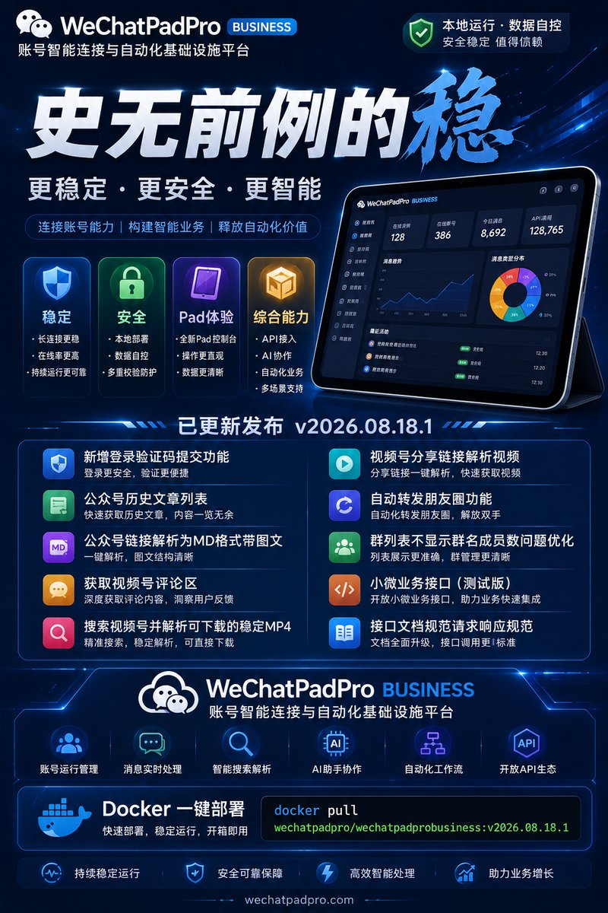

# WeChatPadPro OpenClaw Plugin

**基于 WeChatPadPro (微信 Pad 协议 HTTP API) 的 OpenClaw 适配插件 — 让微信账号接入 OpenClaw AI 自动回复**

[](./LICENSE)

WeChatPadPro 微信 Pad 协议 → OpenClaw gateway → AI 自动回复。支持收发文本/图片/语音/视频/文件、引用回复、图片 AI 识别、语音收发 (silk 自动转码)、群接龙自动触发 AI、多账号。

> **只分享编译后代码** — 本包不含 TypeScript 源码, 提供完整可用的配置向导。



---

## ✨ 功能亮点

| 能力 | 说明 |
|---|---|
| 🤖 **小微 AI 智能体** | 微信内原生 AI 对话 (Chat 会话 + SSE 事件流 + 记忆/邀请/红点/卡片, 20 API **已预开发**) |
| 📨 **消息收发** | 文本 / 图片 / 语音 / 视频 / 文件, 全类型支持 |
| 🤖 **AI 自动回复** | 私聊 / 群聊 @ 机器人 → OpenClaw agent 生成回复 (可接任意 LLM) |
| 💬 **引用回复** | AI 引用用户消息回复 (type=57 引用卡片, 上下文清晰) |
| 🖼 **图片 AI 识别** | AI 多模态看图 (微信图片自动下载 → OSS → 视觉模型) |
| 🎙 **语音收发** | 发语音自动转 silk; 收语音 STT 转文字; 转码失败自动降级发文件 |
| 📋 **群接龙自动触发** | 群里发 `#接龙 xxx` → AI 自动应景回复 (无需 @, 节流防刷屏) |
| 👥 **多账号** | AccountRegistry 多账号隔离, 一个微信一个 agent |
| 📮 **群发消息** | 群发文本到多个群 (`SendGroupMassMsgText`) |
| 📄 **公众号文章** | 拉取文章列表 / 转 Markdown / 阅读解析 |
| 📹 **视频号** | 视频号内容详情 / 评论 / 解析分享链接 |
| 💰 **红包/支付** | 抢红包完整参数 / 无加密兼容打开 |
| 🔐 **安全门禁** | 私聊白名单 (fail-closed) + 群策略 + 凭证 env 隔离 |
| 📊 **监控** | Prometheus metrics (消息/错误/性能) |

> **200+ AI 工具 · 313 vendor 端点 (含小微 20) · 6 配置助手** — 完整能力见 [功能清单](#功能清单)。

---

## ⚡ 快速部署 (先服务端, 再插件)

> **先部署服务端 (vendor), 再装插件** — 插件依赖服务端提供 HTTP API + WebSocket。本包**不含服务端二进制**, 服务端通过官方 Docker 镜像获取。
> **凭证顺序**: 先在 [adminmax.knowhub.cloud](https://adminmax.knowhub.cloud/user/access-tokens) 拿 **tokenKey** → 部署 vendor → 登录后拿 **authcode** → 配插件。

### 第 1 步: 拿 tokenKey (客户端密钥) + 部署服务端 (vendor)

```bash
# 1. 拿 tokenKey: 打开 https://adminmax.knowhub.cloud/user/access-tokens 创建客户端密钥 (只显示一次, 保存好)

# 2. 拉取官方镜像 (build 20260818, 唯一适配版本)
docker pull wechatpadpro/wechatpadprobusiness:v2026.08.18.1

# 3. 解压官方一键部署包 (本包 vendor/ 目录附带), 填 tokenKey
unzip vendor/8075docker-deploy.zip
cd docker-deploy
#    编辑 config/app.conf: user_token_key = "你的客户端密钥"

# 4. 部署: install.sh 引导填 user_token_key (可手动已填) + 自动生成 Redis 密码
chmod +x install.sh check-proxy.sh
./install.sh

# 5. 验证服务就绪
curl http://127.0.0.1:18062          # HTTP API
curl http://127.0.0.1:18062/swagger/  # 313 个 API 文档
```

部署详情见 [`vendor/README.md`](./vendor/README.md) (host 网络 + 独立 Redis + 端口)。

### 第 2 步: 拿 authcode + 人脸认证 + iPad 扫码登录

登录需要 **authcode (X-Access-Token)** — 它由服务端在扫码登录完成后生成。流程:
1. 先用第 1 步的 tokenKey 让服务端跑起来
2. 按 **[`vendor/FACE-LOGIN.md`](./vendor/FACE-LOGIN.md)** 完成: 装人脸 CA 证书 + 18080 白名单 → **GetQR 获取二维码** → 手机扫码 (触发人脸认证) → **CheckQR 确认** → 服务端生成 **authcode**
3. 保存 authcode, 用于第 3 步插件配置

### 第 3 步: 安装插件 (本包)

```bash
# 1. 解压发布包 + 安装依赖
unzip wpp-plugin-release.zip && cd wpp-plugin-release
npm ci

# 2. 配账号 (交互式向导)
cp accounts/default.json.example accounts/default.json
npm run setup add default

# 3. 设环境变量 — WPP_VENDOR_HOST 必设, 否则图片/语音/文件无法下载!
export WPP_VENDOR_HOST="https://your-vendor-domain"   # 你的服务端域名
export WECHATPRO_TOKEN_KEY="..."                      # 第 1 步的 tokenKey (= user_token_key)
export WECHATPRO_AUTHCODE="..."                       # 第 2 步登录拿到的 authcode
export WECHATPRO_DB_PASSWORD="..."                    # MariaDB 密码

# 4. 部署
bash deploy.sh               # 验证 (18+ 项全 PASS)
bash deploy-swap.sh --force  # 真实部署
```

> **zip 小 = 正常**: 发布包只含编译产物, 不含 node_modules。`npm ci` 会根据 package.json 自动下载全部依赖。
> **`WPP_VENDOR_HOST` 别漏**: 媒体下载走白名单, 不设则图片/语音/文件全部无法下载。

---

> 完整安装步骤见 [GETTING_STARTED.md](./GETTING_STARTED.md)。

## 前置要求

- Node.js ≥ 20
- OpenClaw gateway (v2026.7.1+)
- WeChatPadPro 微信 Pad 服务端 (HTTP API + WebSocket)
- MariaDB (存储消息)
- 环境变量: `WECHATPRO_TOKEN_KEY` / `WECHATPRO_AUTHCODE` / `WECHATPRO_DB_PASSWORD`

## 架构

```
微信客户端 ←→ WeChatPadPro 服务端 ←→ 本插件 (OpenClaw channel)
                                          ↓
                                     OpenClaw gateway
                                          ↓
                                       AI Agent
```

- 插件实现 OpenClaw `register(api)` + channel 接口 (start/stop/sendText/sendImage/sendMessage/buildSessionKey + outbound)
- `AccountRegistry` 管理多账号, 每个账号独立 agent
- 消息进站: webhook + WS 双通道 → trigger (@/keyword/msgType/quoteBot/**接龙**) → AI 处理
- 媒体: 图片/语音/视频自动下载 → OSS → AI 多模态识别

## 功能清单

### 📨 消息能力
- **收发全类型**: 文本 / 图片 / 语音 / 视频 / 文件 / 小程序 / 名片 / 位置 / 表情 / 链接卡片
- **发送方式**: 文本 (`SendTxt`)、CDN 图片/视频/文件、base64 上传 (`UploadImg`/`SendFile`)、silk 语音
- **群发**: 群发文本到多个群 (`SendGroupMassMsgText`)
- **结构化卡片**: 链接/小程序/音乐/文件卡片 (`SendAppMessage`)
- **引用回复**: type=57 引用卡片 (上下文清晰)
- **撤回**: 消息撤回 (`Revoke`)

### 🤖 AI 与自动化
- **小微 AI 智能体** (v1.3.69 预开发): 微信内原生 AI 对话 — Chat 会话 + SSE 事件流 (text.delta/message/completed)、记忆 (History)、邀请 (Invites)、红点 (RedDots)、卡片 (Cards)、多智能体 (A2A)。**20 API 已实现, 默认不启用, 待老板确认后开放**
- **AI 自动回复**: 私聊 / 群聊 @ 机器人 → OpenClaw agent 生成回复
- **群接龙自动触发**: `#接龙` 消息 → AI 自动应景回复 (节流防刷屏)
- **图片 AI 识别**: 多模态看图
- **语音 STT**: 收语音转文字; 发语音自动转 silk
- **200+ agent tools**: AI 可调用发消息/查联系人/管群/朋友圈/公众号/视频号等

### 👥 账号与群
- **多账号**: AccountRegistry 多账号隔离, 一个微信一个 agent
- **群管理**: 建群/拉人/踢人/公告/改名/转让群主/设置群头像
- **好友管理**: 加好友/验证/备注/黑名单/标签/通讯录
- **朋友圈**: 发布文字/图片/视频/链接, 收藏圈, 可见范围设置

### 📄 内容与搜索
- **公众号**: 文章列表 / 转 Markdown / 阅读解析 (`ArticleList/Markdown/Read`)
- **视频号**: 内容详情 / 评论 / 解析分享链接 (`Channels/Detail/Comments/ResolveShare`)
- **搜索**: 综合/文章/百科/图书/视频号/小程序/朋友圈/新闻等全垂直
- **AI 搜索对话**: 会话 + 追问 (`Search/AI/Conversation/FollowUp`)

### 💰 支付与红包
- **红包**: 创建/打开/抢红包 (`CreateRedPacket`/`OpenHongBaoWithParams`)
- **收款码**: 生成自定义收款二维码

### 🔧 系统与安全
- **安全门禁**: 私聊白名单 (fail-closed) + 群策略 (open/allowlist/disabled) + 凭证 env 隔离
- **313 vendor endpoints**: 覆盖 WeChatPadPro 服务端全部 API
- **6 channel config helpers**: OpenClaw UI/诊断集成
- **Prometheus metrics**: 消息/错误/性能监控
- **WS 智能退避**: WebSocket 断线自动重连 + 监控告警
- **文件助手命令**: 文件传输助手内管理 — `/genpair` 配对码 `/adduser` 私聊白名单 `/addgroup` 群白名单 `/xiaowei` 小微开关等 (见 [USAGE.md 第 6 章](./USAGE.md#6-文件助手命令))

## 配置

### 账号配置 (`accounts/<id>.json`)

```json
{
  "enabled": true,
  "tokenKeyEnv": "WECHATPRO_TOKEN_KEY",
  "authcodeEnv": "WECHATPRO_AUTHCODE",
  "apiBaseUrl": "http://127.0.0.1:18062",
  "wsUrl": "ws://127.0.0.1:18089/ws/sync",
  "webhookHost": "127.0.0.1",
  "webhookPort": 4398,
  "allowFrom": [],
  "groupPolicy": "allowlist",
  "selfWxid": "YOUR_WXID",
  "nickname": "YourBot",
  "agent": "wpp-wechat"
}
```

- 凭证 (tokenKey/authcode) 一律走环境变量, 不写进 JSON
- `allowFrom` 空 = 拒绝所有私聊 (fail-closed, 安全默认)
- `groupPolicy`: open / disabled / allowlist / closed

### 环境变量

| 变量 | 用途 |
|---|---|
| `WECHATPRO_TOKEN_KEY` | 服务端 API Token |
| `WECHATPRO_AUTHCODE` | 服务端授权码 |
| `WECHATPRO_DB_PASSWORD` | MariaDB 密码 |
| `WPP_VENDOR_HOST` | 你的服务端域名 (媒体下载安全白名单, **必须设否则媒体无法下载**) |
| `WPP_SILK_ENCODER_PATH` | silk 编码器路径 (语音发送转码用, 发布版无默认路径) |
| `WPP_SILK_DECODER_PATH` | silk 解码器路径 (语音转文字用) |

## 安全设计

- 凭证单一来源 env var (不进 JSON / DB)
- 私聊白名单 fail-closed (默认拒绝所有, 防误触发)
- Webhook HMAC 验签 (可选)
- 10MB body cap + 30s 超时 (防 DoS)
- 群策略门禁 (open/disabled/allowlist/closed)
- ReDoS 防护 (所有用户输入 regex 安全处理)

## 目录结构

```
wechatpadpro-openclaw/
├── dist/                      # 编译产物 (不含源码)
├── scripts/setup.js           # 配置向导
├── accounts/
│   └── default.json.example   # 账号配置模板
├── config.json                # 全局配置 (DB)
├── GETTING_STARTED.md         # 快速开始
├── LICENSE                    # MIT
└── openclaw.plugin.json       # OpenClaw manifest
```

## 文档

- [GETTING_STARTED.md](./GETTING_STARTED.md) — 从零安装 + 配置 (快速开始)
- [DEPLOY.md](./DEPLOY.md) — 部署 + 回滚 + 故障排查
- [USAGE.md](./USAGE.md) — 使用说明 (工具 / 配置 / 多账号 / 监控)
- [vendor/README.md](./vendor/README.md) — 配套服务端部署

## 许可证

[MIT](./LICENSE) — 自由使用/修改/商用, 保留版权声明即可。

## 免责声明

- 本插件仅用于合法用途, 使用者需遵守当地法律法规及微信平台条款
- 微信账号可能因违反平台规则被封禁, 使用风险自负
- WeChatPadPro 服务端为第三方协议实现, 与本插件作者无关
